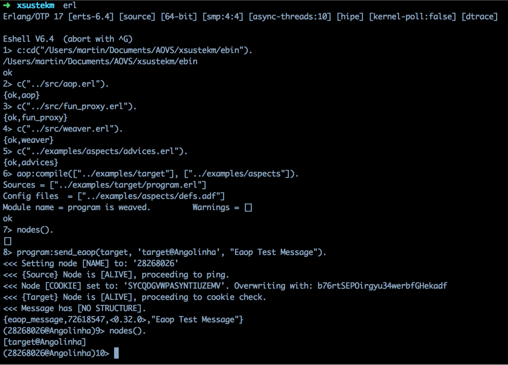
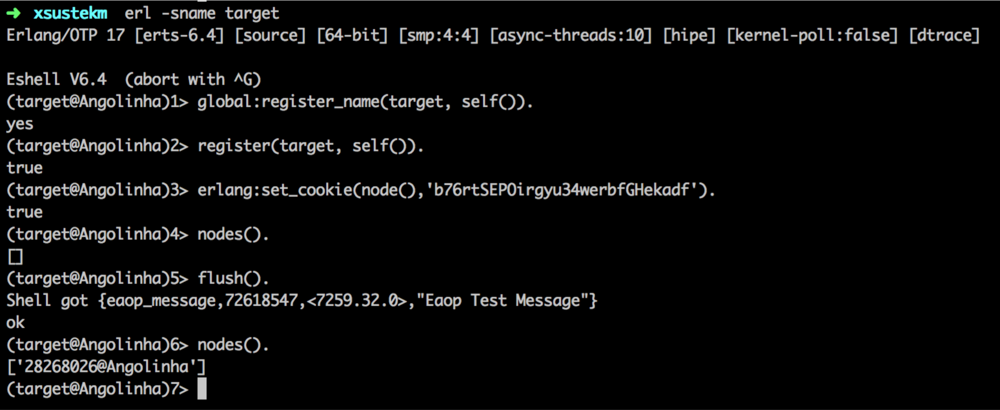

# Erlang Security using AOP
Implementation of messaging end security standards in Erlang processes communication, using Apect-Oriented apporach.

# Sources

Implementation was possible only thanks to Alexei Krasnopolski's [ErlAOP module](http://erlaop.sourceforge.net/).

# Usage

